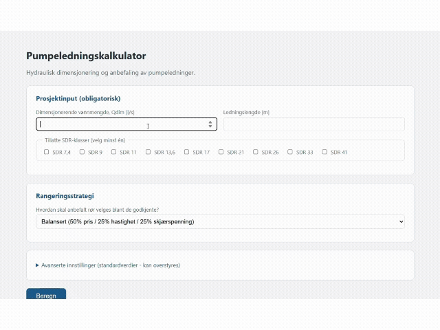

# PipeSelector

PipeSelector sammenligner og dimensjonerer PE-rør for pumpeledninger, typisk
sjøledninger for avløp. Verktøyet beregner hydraulikk, ballastbehov og kostnad,
kontrollerer prosjektets krav og anbefaler et rør blant godkjente alternativer.
Det har et nettlesergrensesnitt, et FastAPI-API og et lokalt kommandolinjeprogram.

## Oversikt

Oppgi dimensjonerende vannmengde, ledningslengde og tillatte SDR-klasser.
Juster kravgrenser og kostnadsforutsetninger ved behov, og velg en
rangeringsstrategi. Resultatet viser anbefalingen, godkjente alternativer
og årsakene til at andre alternativer er underkjent. Valgte rør kan
sammenlignes i grafer og i en nedlastbar PDF-rapport.

## Funksjoner

- Sammenligning av tilgjengelige DN/OD- og SDR-kombinasjoner fra rørkatalogen.
- Vannhastighet, Reynolds-tall, friksjonstap, singulærtap og skjærspenning.
- Kravkontroll for hastighet, skjærspenning, totalt tap, SDR-trykk,
  maksimal utvendig diameter og SDR-grense.
- Oppdrift, betongballast og kostnader fordelt på sjø- og landlengde.
- Rangering etter laveste pris, hydrauliske marginer eller vektet score.
- Prisgraf, ledningskarakteristikker og PDF med beregningsgrunnlag og sammenligning.
- CSV- og Excel-eksport av oppdrift/lodd-tabeller fra kommandolinjen.
- Valgfri AI-formulert vurdering i PDF-en, basert på eksisterende rapportdata.

## Slik fungerer det

Rørkatalog og validerte inndata går gjennom beregning, kravkontroll og
rangering. Bare godkjente alternativer kan anbefales eller velges til
rapportsammenligning. PDF-en bruker beregningsresultatene; den valgfrie
AI-teksten påvirker ikke beregninger, kravstatus eller rørvalg.

## Installasjon

Krever Python 3.10 eller nyere. Fra prosjektmappen, i PowerShell:

```powershell
python -m venv .venv
.\.venv\Scripts\python.exe -m pip install -r requirements.txt
```

På macOS/Linux brukes `.venv/bin/python` i stedet for
`.\.venv\Scripts\python.exe` i kommandoene nedenfor.

## Kjøring

Start API-et og nettlesergrensesnittet:

```powershell
.\.venv\Scripts\python.exe -m uvicorn api:app --reload
```

Åpne [brukergrensesnittet](http://127.0.0.1:8000/ui/).
[API-dokumentasjonen](http://127.0.0.1:8000/docs) viser inndata, standardverdier
og endepunkter for beregning, grafer og rapporter. UI-et krever at API-et kjører.

For lokal tabell-eksport og plott:

```powershell
.\.venv\Scripts\python.exe main.py
```

Prosjektverdiene for denne kjøringen settes i `main()`. Genererte filer
skrives til `resultater/`, som er ignorert av Git. PDF-er fra API-et
genereres i minnet og lastes ned til klienten.

### Valgfri faglig vurdering

AI er avslått som standard. Opprett `.env` ved siden av `api.py`, med
`.env.example` som mal. For å aktivere vurderingen, sett:

```dotenv
PIPESELECTOR_AI_ENABLED=true
OPENAI_API_KEY=your_api_key_here
OPENAI_MODEL=gpt-4.1-mini
```

Legg din egen nøkkel i det lokale nøkkelfeltet. `.env` leses ved oppstart;
start serveren på nytt etter endringer. Eksisterende miljøvariabler har
prioritet. `OPENAI_MODEL` er valgfri, og `PIPESELECTOR_AI_ENABLED=false`
slår av funksjonen. `.env` skal aldri versjoneres; `.env.example` har tom nøkkel.

Ved aktivering sendes et utdrag av rapportdata til OpenAI Responses API.
Teksten skal forklare eksisterende resultater, men er ikke faglig verifisert.
Manglende nøkkel, timeout eller API-feil gir en vanlig PDF uten vurderingen.
Ingen OpenAI-kall utføres i testene.

## Tester

```powershell
.\.venv\Scripts\python.exe -m pytest
```

Testene dekker formler, katalogvalidering, kravkontroll, rangering,
tjenestelag, API, grafer, PDF og valgfri AI-tekst med simulerte svar.

## Prosjektstruktur

```text
pipe-selector/
|-- api.py                     API og statisk UI
|-- main.py                    Lokal kjøring, eksport og plott
|-- tjenester.py               Katalogvalidering, beregning og rangering
|-- hydraulikk.py              Hydrauliske formler
|-- oppdrift_lodd.py            Oppdrift, ballast og kostnader
|-- beregninger.py             Alternativberegning og kravkontroll
|-- rangering.py               Valg av anbefalt rør
|-- modeller.py                Validerte inndata og resultater
|-- data_io.py                 Innlesing og validering av rørkatalog
|-- plotting.py                Grafer for CLI, UI og PDF
|-- eksport.py                 CSV- og Excel-eksport
|-- rapport.py                 Strukturert rapportgrunnlag
|-- rapport_pdf.py             PDF-presentasjon
|-- rapport_ai.py              Valgfri tekstvurdering
|-- config.py                  Prosjektrelative stier og .env-innlesing
|-- data/RØR.csv               Rørkatalog
|-- static/index.html          HTML, CSS og JavaScript uten byggverktøy
|-- tests/                     pytest-tester
|-- docs/faglig-grunnlag.md     Formler, enheter og katalogformat
|-- requirements.txt           Avhengigheter
`-- .env.example               Konfigurasjonsmal uten hemmeligheter
```

## Faglig grunnlag og begrensninger

Hydraulikken bruker Darcy-Weisbach med iterativ Colebrook-White for turbulent
strømning og `f = 64/Re` for laminær strømning. Oppdrift beregnes fra volum
og tetthet; kostnaden omfatter rør, ballast og oppgitt sjøleggekostnad.
[Faglig grunnlag](docs/faglig-grunnlag.md) beskriver formler, enheter,
kravkontroll, rangering og katalogformat.

Totalt tap omfatter friksjons- og singulærtap, uten statisk løftehøyde.
Kravkontrollen inkluderer en fast SDR-grense på 19. Katalogens
veggtykkelseskontroll kan avvise små rør med produksjonsteknisk
minimumstykkelse. Resultatene avhenger av valgte parametere og katalogdata,
og må vurderes mot prosjektspesifikke forhold. Verktøyet er beslutningsstøtte
og erstatter ikke detaljprosjektering.
